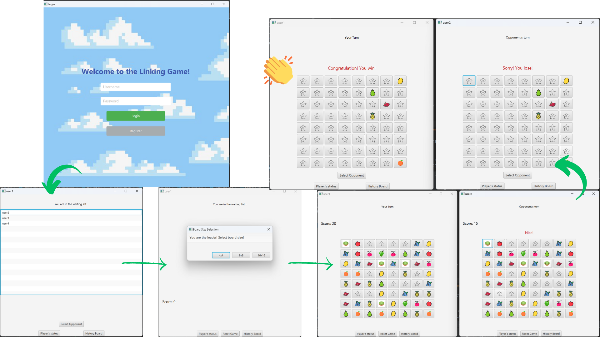

# CS209A Linking Game Java
This is a Java-based multiplayer linking game that leverages JavaFX for the user interface and incorporates server-client communication to support multiple players.

The implementation will involve:
- Socket Programming
- Multithreading
- JavaFX for the graphical interface

## Game Setup
### Server-Side Implementation
   The server will manage game states, handle client connections, and ensure proper synchronization between
   clients and server.
- When the server accept clients, it adds the request to the waiting queue, notifies the client, and on the interface of the client displays indication of entering a waiting status.
- The server can synchronize a randomly generated board with both clients, and the client interface correctly displays it. Before sending the initial board, the server should check whether the board is valid.
- Both players take turns  until the game ends. The server judge the end and notify both clients with the game results.
- The server can handle multiple matches, if the number of clients is odd, it should be put in the waiting list.

### Client-Side Implementation
The client program will handle game interactions and facilitate communication with the server.
- Client can login or register with username and password.
- When its client is in the waiting state, it can see other clients are waiting and can select its opponenet. The first player who select determine the game board size and play first.
- If a client is disconnected during the game, its player can connect again to the server and resume its match.
- When the game ends, the two players will go back to the waiting list and can play the game again.

### Game Rule
- The player will play the game iteratively.
- Point accumulation: 5 points for 1-line connection, 10 points for 2-line connection, and 15 points for 3-line connection.
- Player should wait for its opponent to takes turn.
- If the tiles are not connected, its player will get notified and no poin will be added.
- Players with highest score will be the winner.

### Exception Handling
- If the server shuts down unexpectedly, clients can detect it and handle it appropriately.
- If one client disconnects during gameplay, the server notifies the opponent’s client and handles it appropriately.
- If a client disconnects during the waiting process, the server handles it appropriately.
- If both clients disconnect, the server should terminate the session and log it.

### Source Files

#### `ClientApp.java`
- The main entry point of the application.
- Initializes the application and launches the JavaFX interface.

#### `Game.java`
- Manages the game logic, including rules and game state.
- Controls the overall behavior of the game and validates moves.

#### `Controller.java`
- Handles UI interactions and events on the game board screen (`board.fxml`).
- Connects user actions with the game logic.

#### `LoginController.java`
- Manages user login and registration processes.
- Handles events and transitions for the login and registration screen (`login.fxml`).

#### `ClientHandler.java`
- Facilitates communication between the server and connected clients.
- Processes incoming and outgoing messages from individual clients.

#### `GameServer.java`
- Manages the server-side operations, including handling multiple client connections.
- Maintains game sessions and synchronizes game states between players.

#### `GameClient.java`
- Handles the client-side network communication.
- Connects to the `GameServer` and relays messages to and from the client application.

#### `GameSession.java`
- Represents an active game session.
- Coordinates between players and ensures game rules are adhered to during gameplay.

### FXML Files

#### `board.fxml`
- Defines the prototype for the game board UI.
- Provides the layout and design of the game's main screen.

#### `login.fxml`
- Defines the prototype for the login and registration UI.
- Provides the layout for user authentication screens.

### Resources

#### Images
- Stores assets used in the game board, such as icons and images.
- Icons sourced from [Iconfont](https://www.iconfont.cn/).

#### Player Data
- Stores player information in `playerdata.txt` file for login credentials.
- Stores match history (players, game result, and time) in `playerHistory.txt`.

## Environment

**java JDK**: openjdk-23 (Oracle OpenJDK 23.0.1)

**javafx-fxml**: 22.0.1

**javafx-controls**: 22.0.1

**maven**: 3.8.5

## Acknowledments